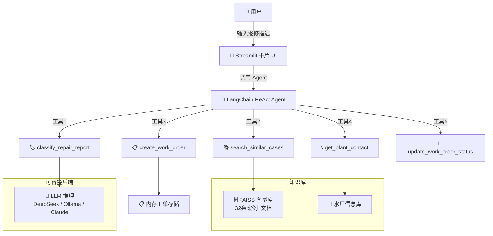

# 💧 水厂报修智能分类系统

> Water Plant Repair Report — AI-Powered Classification & Work Order Agent

[](https://www.python.org/downloads/)
[](https://streamlit.io/)
[](https://www.langchain.com/)
[](LICENSE)
[](https://github.com/Emma-9055/WaterPlant_Demo/actions)

基于 **RAG 知识库 + LangChain Agent + Streamlit** 的水厂报修智能分类与工单管理系统。输入报修描述，AI 自动分类故障类型、评估紧急程度、检索历史相似案例、创建工单——全部以卡片形式展示。

## 📸 效果预览

> *部署后截图，替换为你的 App 实际效果*

```
┌──────────────────────────────────────────────────────┐
│  💧 水厂报修智能分类系统                              │
│  ┌─────────────────┐  ┌──────────────────────────┐   │
│  │ 📝 报修输入      │  │ 🏷️ 分类结果               │   │
│  │ [文本输入框]     │  │ 类别: 水泵故障             │   │
│  │ [水厂下拉]      │  │ 紧急: 🔴 紧急             │   │
│  │ [🔍 提交分析]   │  │ 置信度: 94%              │   │
│  └─────────────────┘  └──────────────────────────┘   │
│  ┌─────────────────┐  ┌──────────────────────────┐   │
│  │ 📚 相似案例      │  │ 📋 工单状态               │   │
│  │ 0.725 水泵轴承   │  │ WO-20260622-001          │   │
│  │ 0.588 电机绝缘   │  │ 🔵 处理中                │   │
│  │ 0.587 计量泵     │  │ 👤 张建国               │   │
│  └─────────────────┘  └──────────────────────────┘   │
│  ┌──────────────────────────────────────────────┐   │
│  │ 📞 城北水厂 | 张工 | 138-...                  │   │
│  └──────────────────────────────────────────────┘   │
└──────────────────────────────────────────────────────┘
```

> 🚀 **在线体验**: [waterplantdemo.streamlit.app](https://waterplantdemo-ghkyileiap87fcknmmprlu.streamlit.app/)

## 🎯 功能

| 功能 | 描述 |
|------|------|
| 🔍 **智能分类** | LLM 自动判断报修类别（管道漏水/水泵故障/电气故障/水质异常/阀门故障） |
| ⚡ **紧急评估** | 自动判定紧急程度（紧急/一般/低），紧急报修必须创建工单 |
| 📚 **RAG 检索** | FAISS 向量库检索历史相似案例，展示处理方案做参考 |
| 📋 **工单管理** | 自动创建工单、指派水厂负责人、跟踪处理状态 |
| 📞 **联系方式** | 一键查询各水厂联系人、电话、地址 |
| 🔄 **平台可扩展** | 向量库抽象基类，切换 Dify / Pinecone 只需一个文件 |

## 🏗️ 系统架构



## 🚀 快速开始

### 在线体验（零安装）

👉 **[waterplantdemo.streamlit.app](https://waterplantdemo-ghkyileiap87fcknmmprlu.streamlit.app/)**

### 本地运行

```bash
# 1. 克隆
git clone https://github.com/Emma-9055/WaterPlant_Demo.git
cd WaterPlant_Demo

# 2. 安装依赖
pip install -r requirements.txt

# 3. 配置 Key（三选一）
cp .env.example .env
# 编辑 .env:
#   方式A: DeepSeek（推荐，国内直连）
#     LLM_PROVIDER=deepseek
#     DEEPSEEK_API_KEY=sk-你的key
#   方式B: Ollama（完全免费，需本地安装）
#     LLM_PROVIDER=ollama
#     ollama pull qwen3:8b
#   方式C: Anthropic Claude
#     LLM_PROVIDER=anthropic
#     ANTHROPIC_API_KEY=sk-ant-...

# 4. 运行
python app.py
# → http://localhost:8501
```

## 📂 项目结构

```
├── app.py                      # 入口：初始化 + 启动
├── config.py                   # LLM 工厂（5 种后端）+ 向量库工厂
├── models.py                   # Pydantic 数据模型
├── data/
│   └── seed_data.py            # Mock 数据（5 水厂 + 20 案例 + 12 文档）
├── vector_store/
│   ├── __init__.py             # 抽象基类 + 工厂（⚠️ Dify 切换点）
│   └── faiss_impl.py           # FAISS（双模式：Transformer / TF-IDF 降级）
├── agent/
│   ├── tools.py                # 5 个 LangChain 工具
│   └── orchestrator.py         # ReAct Agent + System Prompt
├── ui/
│   └── app.py                  # Streamlit 卡片 UI
├── .github/workflows/
│   └── test.yml                # CI 自动验证
└── build_index.py              # 一键重建 FAISS 索引
```

## 🔧 定制指南

| 你想改什么 | 改哪个文件 |
|-----------|-----------|
| 知识库内容（水厂/案例/维修指南） | `data/seed_data.py` |
| Agent 的行为逻辑和回复风格 | `agent/orchestrator.py` → `SYSTEM_PROMPT` |
| 分类标准和紧急度判定规则 | `agent/tools.py` → `_classify_with_llm()` |
| 前端样式和卡片布局 | `ui/app.py` |
| 切换 LLM | `.env` 改一个环境变量 |
| 切换向量库（Dify / Pinecone / Milvus） | 新建一个 `*_impl.py` 实现 `VectorStoreBase` |

## 🔌 平台扩展

架构通过 `VectorStoreBase` 抽象基类解耦。当前实现了 FAISS，可无痛扩展到：

| 后端 | 场景 | 需做什么 |
|------|------|---------|
| **FAISS**（当前） | 本地开发、Demo | 零配置 |
| **Dify** | 非程序员维护知识库 | 新建 `dify_impl.py` |
| **Pinecone / Weaviate** | 生产环境大规模检索 | 新建 `*_impl.py` |
| **Milvus / Chroma** | 私有化部署 | 新建 `*_impl.py` |

切换后端后，Agent 和 UI 代码**零改动**。

## 📄 License

MIT
